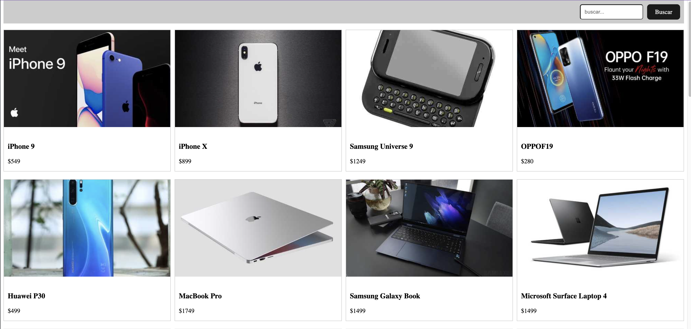

# prueba-tecnica-react 🏆🏆
Prueba técnica - react typescript - semi senior

### 🤝 Connect with me | Ponte en contacto conmigo:

<a href="https://www.linkedin.com/in/arvprincipe/"></a>
<a href="https://instagram.com/arvprincipe.dev"></a>
<a href="https://www.facebook.com/arvprincipedev"></a>
<a href="https://arvprincipe.com/"></a>
</br>

esta es una prueba técnica realizada para un puesto de un desarrollador web semi senior



# Enunciado
## Instrucciones
Se requiere crear una aplicación que liste los primeros 12 productos. Esta debe estar listada en filas de 4 columnas tal como se muestra en la imagen de referencia y debe ser responsive. Además, agrega un campo para realizar búsquedas por un determinado término. Se debe realizar la búsqueda según el usuario vaya escribiendo(validar que espere un tiempo antes de lanzar la llamada al api) y también cuando de click en el botón buscar.

## Requerimientos
- Utilizar styled-components para estilar los componentes
- Mostrar un placeholder(Skeleton) mientras se cargan los productos
- Utilizar typescript en el proyecto

## Criterios de evaluación
- Asegúrese de que su código está correctamente organizado y es fácil de leer.
- Correcta uso de los elementos Semánticos
- Buenas prácticas


## Para esta prueba técnica utilizar el siguiente API Rest

API Url:
- https://dummyjson.com/products
- https://dummyjson.com/products/search?q=phone

Docs:
- https://dummyjson.com/docs

## Installation
```
pnpm install
```

## Start server
```
pnpm run dev
```

Instagram: [@arvprincipe.dev](https://www.instagram.com/arvprincipe/) - Mi lugar favorito para publicar y compartir historias<br>
Facebook: [@arvprincipedev](https://www.facebook.com/arvprincipe) - Ver todos mis posts y donde anuncio cosas<br>
Linkedin: [@arvprincipe](https://www.linkedin.com/in/arvprincipe/) - Mi perfil para contactar<br>
Mi blog: [Mi blog personal](https://www.arvprincipe.com) 🌐
## Descarga y comparte 🇵🇪
Por supuesto. Puedes descargar y compartir mi código. . Si has obtenido algún valor de mi contenido y te gustaría ayudarme a llegar a más gente, ¡por favor compártelo!

## Download & Share 🇺🇸

Absolutely!!! You can download and share my code. . If you have gotten any value from my content and would like to help me reach more people, please share it!

## Contribution

Yes! Anyone is welcome to contribute to the quality of this content. Please feel free to submit a PR request for typo fixes, spelling corrections, explanation improvements, etc.
